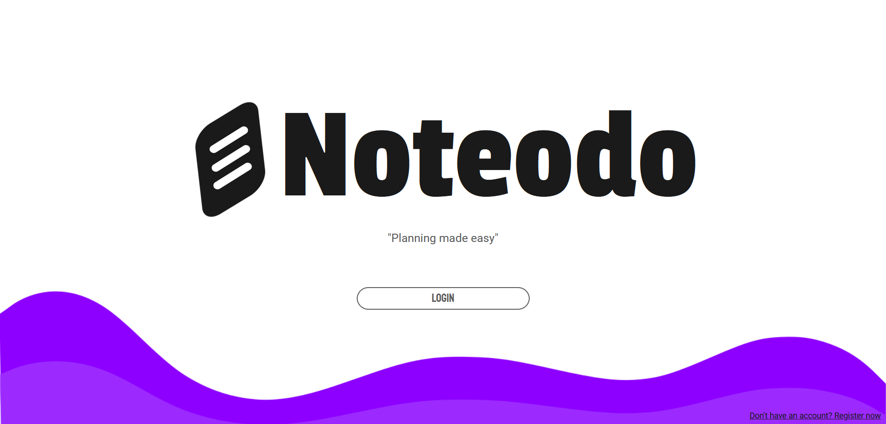
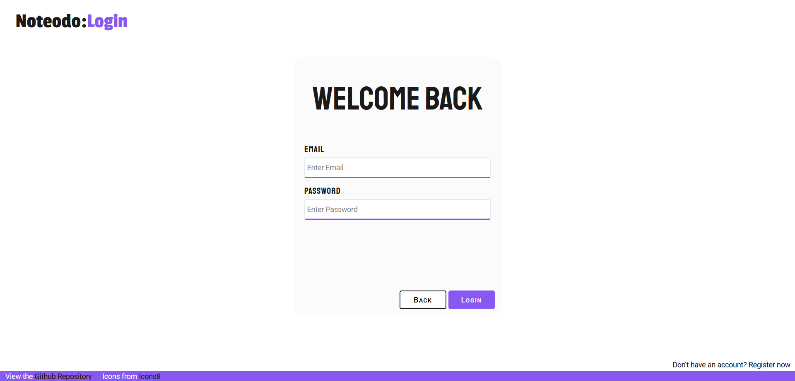
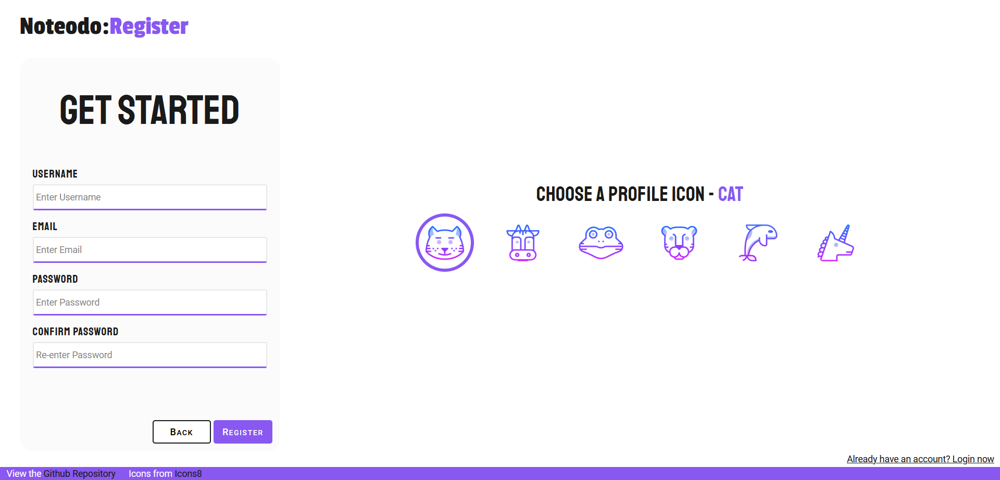
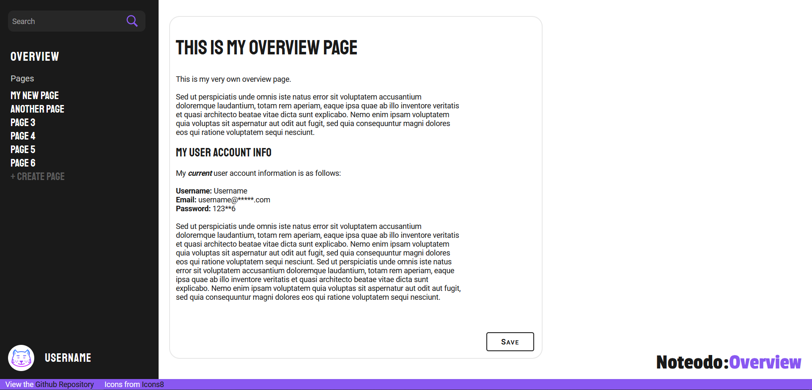
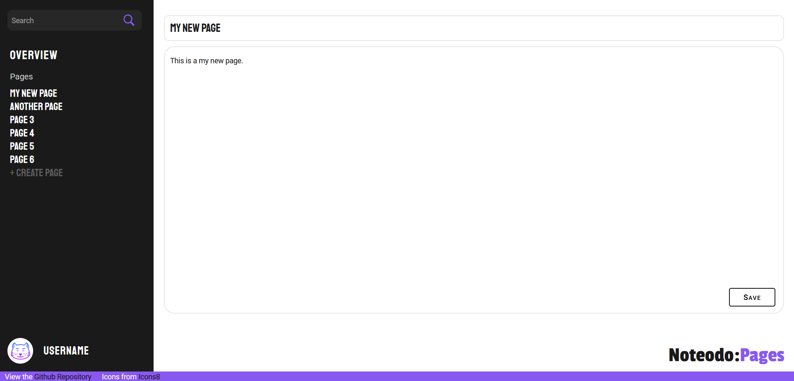

# Noteodo

Noteodo is a note taking and to-do list application designed to help individuals organize their tasks and notes in one convenient space. The site uses Vue.js for the frontend as well as Node.js and Express for the backend. 

**Note**: This project is currently a work in progress and, as a result, is still missing some functionality. 

### Features 
- Passwords are hashed using bcrypt and stored, alongside other data, in a postgres database 
- Makes use of the CKEditor 5 Text Editor 
- Features user authentication with JWT and [Passport](http://www.passportjs.org/) middleware
- Backend testing is done using a combination of Mocha, Chai, and Postman 
- Makes use of custom CSS and, in particular, takes advantage of the SASS preprocessor scripting language

### Screenshots 

### Things to add
- Finish Todo list implementation
- Publish site 

### Author
Shivam Sood

